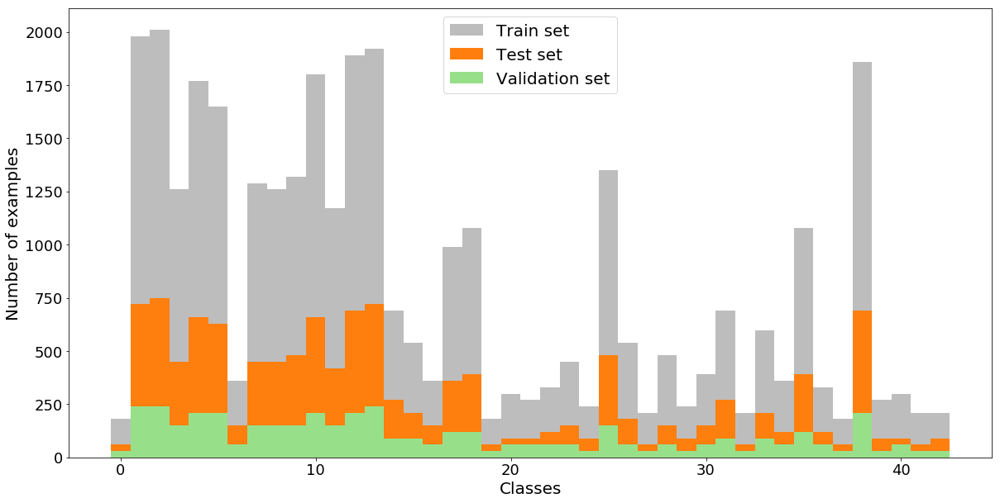
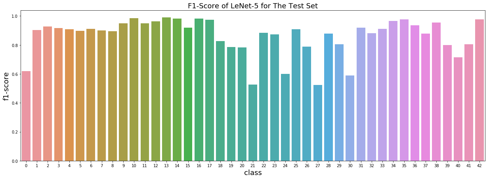
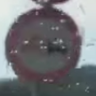
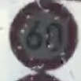
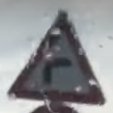
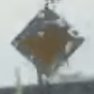

# German Traffic Signs Classifier Project

The aim of this project is to classify the German traffic signs implementing deep convolutional neural network architectures with the [Tensorflow framework](https://www.tensorflow.org/).

## The Dataset

The dataset is provided by [German Traffic Sign Recognition Benchmark (GTSRB)](http://benchmark.ini.rub.de/?section=gtsrb). The details of the dataset and the results of the final competition is reported on [this paper](http://image.diku.dk/igel/paper/MvCBMLAfTSR.pdf) written by J. Stallkamp, M. Schlipsing, J. Salmen and C. Igel.

The dataset used in this project is the same dataset provided by INI-GTSRB Benchmark with the images are prepared in downloadable pickle file formats by [Udacity self-driving car nanodegree program](https://www.udacity.com/drive) and is available [here](https://drive.google.com/open?id=0B8c3GUF4ZQ-_R29QOWxDTkRJV3c).

### The train, validation and the test sets

The dataset is split into three parts as the train, validation and the test sets. The train set consists of 34799 examples, validation set only has 4410 examples and the test set has 12630 examples. The train set is used for training the deep convolutional neural network models while the validation set is used to fine tune the model hyperparameters. After fine tuning and training the models, the test set used for evaluating the model.

All the images in these sets has the same dimensions of 32x32 pixels of height and width and 3 RGB color channels. The total number of classes of the traffic signs is 43. The traffic sign examples from the same classes was captured in different ligthing conditions, from different viewpoints, some of them have low, even 15x15 input resolution (all the images are resized to 32x32) and some of the examples have physical damage, graffiti and stickers. The randomly choosen images for each class from the test set can be seen below.

|  The Visualization of Some of The Test Set Examples |
|:-------------------------:|
|   |

### The distribution of classes in the train, validation and the test sets

It is important to have each class in a dataset has approximately the same number of examples. The graphs below shows the frequency distribution of the classes in train, validation and test sets.

As seen from the frequency distributions, in each dataset, the number of examples are different for each class. When this is the case, an overfit may occur while training the model. Thus, for the final network model ([scaled AlexNet](#c-the-alexnet-architecture)), data augmentation will be applied for train and validation sets. In addition, if the trained model guessing at random or most of the time guesses for a class with high frequency, a simple accuracy evaluation may not reflect the truth. Thus, besides the accuracy evaluation, another error metric called [f1-score](https://en.wikipedia.org/wiki/F1_score), where the [precision and recall](https://en.wikipedia.org/wiki/Precision_and_recall) measures are used together, is also obtained for each class.

## The Model Architectures

### A) The LeNet Architecture

Source: ([Y. Lecun, L. Bottou, Y. Bengio and P. Haffner, 98](http://ieeexplore.ieee.org/document/726791/))

At first, without any data augmentation, the famous [LeNet-5 architecture](http://ieeexplore.ieee.org/document/726791/) is used for training. A diagram of this architecture is shown above from Lecun's [paper]((http://ieeexplore.ieee.org/document/726791/)). The architecture consists of two convolutional, two subsampling layers, a flattened layer, two fully connected layers and a final output layer of logits. The input to original LeNet-5 is 32x32x1 but since the dataset in this project has 3 color chanels, the LeNet architecture takes images of 32x32x3 here. For the implementation details, please visit [this notebook](./Traffic_Sign_Classifier.ipynb#Model-Architecture).

#### Details of the architecture

As mentioned above, the input images (normalized and zero-centered) have 32x32x3 dimensions which is different from original LeNet by having 3 color dimensions instead of 1. Layer 1 of the model is a convolutional layer having 6 kernels of size 5x5x3 with a stride of 1x1. After layer 1, a rectified linear unit (ReLu) activation and a 2x2 max pooling with a stride of 2x2 are applied. Layer 2 is again a convolutional layer with 16 kernels of size 5x5x6 and 1x1 stride. And again, ReLu activation function and a 2x2 max pooling with a stride of 2x2 are applied. After these operations, the feature maps are flattened and connected to the layer 3 which is a fully connected layer. Layer 3 has 120 nodes and ReLu is applied to the output. The layer 4 is also a fully connected layer and has 84 nodes with ReLu activation function is applied to the output. The layer 5 is the output layer with 43 nodes.

#### The training and the results for Lenet-5 architecture

The LeNet-5 model tuned and trained on the original training and validation sets without any data augmentation applied. In the [training process](./trainer.py), stochastic gradient descent algorithm is used with mini-batch size of 128. Applying Xavier initialization for the weights gives the filexibility to choose larger learning rates ([X. Glorot and Y. Bengio, 2010](http://proceedings.mlr.press/v9/glorot10a.html)). Thus, applying Xavier initialization, the learning rate is taken as 0.1 with an exponential decay. An early stopping algorithm is implemented within a limit of 200 epochs. After the training, the test set is evaluated with the best model weights performed on the validation set.

For LeNet-5, best validation accuracy is 92.58% and the test accuracy with the best model is 91.18%. The calculated f1-scores for each class can be seen below ([source](./Traffic_Sign_Classifier.ipynb#LeNet-without-dropout)).

F1-scores are given for each class. F1-score is a measure of precision and recall are used together. If the model predicts well on a class, that class should have high precision and recall values, which, here in this case, represented by the f1-score values very close to 1. As can be seen from the figure above, most of the classes have very poor f1-score values. For this reason, model improvements, and even a different model with data augmentation will be implemented.

### B) The LeNet Architecture with Dropout

Dropout technique prevents neural networks from overfitting ([N. Srivastava, G. Hinton, A. Krizhevsky, I. Sutskever and R. Salakhutdinov, 2014](https://www.cs.toronto.edu/~hinton/absps/JMLRdropout.pdf)). The dropout refers to temporarily removing some of the randomly chosen hidden/visible units in a neural network on the training process. This way the dropout technique breaks up the co-adaptations of the nodes in a layer and the model generalizes better. Thus for the same LeNet-5 architecture above, dropout is implemented for the fully connected layers to generalize the model.

#### The results for LeNet-5 with dropout

The same process of traning is again used for the same LeNet-5 architecture by additionally implementing dropouts to fully connected layers.

For LeNet-5 with dropout, the best validation accuracy is 98.00% and the test accuracy with the best model is 95.73%. The calculated f1-scores for each class can be seen below ([source](./Traffic_Sign_Classifier.ipynb#LeNet-with-dropout)).

The accuracy and the f1-scores for each class are improved indicating that the model generalizes better when dropout is applied. However, for some of the classes, the model still predicts very poorly.

### C) The Alexnet Architecture

The AlexNet model is the [ILSVRC](http://www.image-net.org/challenges/LSVRC/)-2012 competition winning, deep convolutional neural network architecture which had error rates considerably better than the previous state-of-the-art results ([A. Krizhevsky, I. Sutskever and G. E. Hinton, 2012](https://papers.nips.cc/paper/4824-imagenet-classification-with-deep-convolutional-neural-networks)). The major difference from the LeNet-5 architecture is that AlexNet has more convolutional layers as being a deeper model. The LeNet-5 was built to train a dataset with 10 clases, however, AlexNet was built to predict 1000 clases. In 2012, recently developed advanced GPUs had let this kind of extended deep convolutional network architectures to be trained in a reasonable time for large images of 1000 clases. The achievements of the AlexNet on large scale images revealed the significance of deep convolutional neural networks.

In the following years, it has also been shown by the other ILSVRC deep convolutional network models that the deeper models achieve better results ([K. Simonyan and A. Zisserman, 2014](https://arxiv.org/abs/1409.1556)). And even the skip connections help on very deep models that achieve even better results ([K. He, X. Zhang, S. Ren and J. Sun, 2015](https://arxiv.org/abs/1512.03385)). Since the dataset in this project has relatively small images and less classes (43 classes), a scaled-down AlexNet architecture ([scaled AlexNet](./scaledalexnet.py)) is used for the project. The scaled AlexNet has half the number of feature maps in each convolutional layer and half the number of nodes in fully connected layers. In addition, since the image size is relatively small, the kernel sizes are choosen smaller than it is in the original model. And some of the operations are not applied such as local response normalization which has been reported that it does not improve the model performance ([K. Simonyan and A. Zisserman, 2014](https://arxiv.org/abs/1409.1556)).

#### Details of the scaled AlexNet architecture

The first layer is a convoltional layer filters normalized and zero-centered 32x32x3 input images with 48 kernels of size 3x3x3. Layer 2 takes the output of layer 1 and filters with 128 kernels of size 3x3x48. The third and the fourth convolutional layers have 192 kernels of sizes 3x3x128 and 2x2x192 respectively. The fifth layer is the last convolutinal layer having 128 kernels of size 3x3x192. The ReLu activation function is applied to the outputs of all convolutional layers and a 2x2 max pooling operations with 2x2 strides are applied after the ReLu operations of layer 1 and layer 5. After the layer 5, the following two layers are fully connected layers with 1024 nodes. ReLu operation and dropout are applied to the outputs of fully connected layers while training. Layer 8 is the output layer with 43 nodes ([source](./scaledalexnet.py)).

A detailed list of layers and operations are given in the table below.

| Layers and Operations                     | Details                                       | 
|:-----------------------------------------:|:---------------------------------------------:| 
| Input                                     | 32x32x3 RGB image                             | 
| Convolution 3x3x3                         | 48 kernels, 1x1 stride, valid padding         |
| RELU                                      |                                               |
| 2x2 max pooling                           | 2x2 stride                                    |
| Convolution 3x3x48                        | 128 kernels, 1x1 stride, valid padding        |
| RELU                                      |                                               |
| Convolution 3x3x128                       | 192 kernels, 1x1 stride, valid padding        |
| RELU                                      |                                               |
| Convolution 2x2x192                       | 192 kernels, 1x1 stride, valid padding        |
| RELU                                      |                                               |
| Convolution 3x3x192                       | 128 kernels, 1x1 stride, valid padding        |
| RELU                                      |                                               |
| 2x2 max pooling                           | 2x2 stride                                    |
| Flatten                                   | 2048 nodes, flatten the output of previous conv. layer    |
| Fully connected                           | 1024 nodes                                    |
| RELU                                      |                                               |
| Fully connected                           | 1024 nodes                                    |
| RELU                                      |                                               |
| Softmax                                   | 43 output nodes                               |
|                                           |                                               |

#### Data augmentation

To avoid overfitting, for the scaled AlexNet model, data augmentation is aplied on train and validation sets. In each set, each class with the number of examples are less than two thousand, rised up to a number of two thousand and two thousand and ten examples by appying random rotations, translations and viewpoint transformations to existing examples. By having two thousand and ten examples for the train and two thousand examples for the validation sets, the model fine tuned and trained to evaluate on test sets ([source](./data-augmentation-equal-numbers.ipynb)).

#### The results of scaled AlexNet

For the scaled AlexNet, the same [training process](./salexnet-equal-n/trainer.py) is used as it was for the LeNet-5 architecture, again with early stopping and limiting the maximum number of epochs to 200. The scaled AlexNet perform better than the LeNet-5 model as expected.

The scaled AlexNet achieved a test accuracy of 98.18% with the best model. The f1-scores for each class is plotted below ([source](./salexnet-jittered-datasets-equal-n.nbconvert.ipynb)).

As can be seen from the plot of f1-scores, scaled AlexNet predicts better for all the classes and most of the classes have a f1-score value higher than 0.85.

#### Ensemble averaging

It has been reported by the winner of the [GTSRB](http://benchmark.ini.rub.de/?section=gtsrb) competition that they used multiple convolutional neural network models to average out their performance ([D. Ciresan, U. Meier, J. Masci and J. Schmidhuber, 2012](http://www.sciencedirect.com/science/article/pii/S0893608012000524)). For the same purpose, ten identical scaled AlexNet models initialized with Xavier weights and the logits of the three models with the best performance are averaged to get a higher accuracy.

| Model No              |  Validation Accuracy       |   Test Accuracy       |   Number of epochs    |
|:---------------------:|:--------------------------:|:---------------------:|:---------------------:| 
| 1                     |  96.66%                    |  97.69%               |  200                  |
| 2                     |  95.18%                    |  97.66%               |  25                   |
| **3**                 |  **95.56%**                |  **98.03%**           |  **51**               |
| **4**                 |  **96.03%**                |  **98.19%**           |  **55**               |
| 5                     |  96.28%                    |  97.76%               |  57                   |
| 6                     |  95.93%                    |  97.88%               |  21                   |
| **7**                 |  **96.56%** p               |  **98.00%**           |  **65**               |
| 8                     |  96.45%                    |  97.66%               |  79                   |
| 9                     |  94.91%                    |  97.47%               |  27                   |
| 10                    |  95.06%                    |  97.45%               |  21                   |

The three models with the best test accuracy (model 3, 4 and 7) are used for ensemble averaging. The f1-scores are given below for these three models.

As can be seen from the plot of f1-scores, each model has a different performance for each class. Thus and averaging of the logits of these models can improve the accuracy on the test set evaluation.

By averaging the logits of model 3,4 and 7, accuracy on the test set becomes 98.38% ([source](./ensemble-average-evaluation.ipynb)). The reason each trained model has a different epoch number is, during the training, an early stopping algorithm was used.

### Improving The Performance

The winning team of the [GTSRB](http://benchmark.ini.rub.de/?section=gtsrb) competition achived 99.46% accuracy on the test set ([D. Ciresan, U. Meier, J. Masci and J. Schmidhuber, 2012](http://www.sciencedirect.com/science/article/pii/S0893608012000524)). And the average human accuracy is reported as 98.84 ([J. Stallkamp, M. Schlipsing, J. Salmen and C. Igel, 2012](http://www.sciencedirect.com/science/article/pii/S0893608012000457)).

With ensemble averaging, scaled AlexNet got an accuracy of 98.38% on the test set. To get even higher accuracies, it is possible to apply extra data augmentation techniques. For instance, since the examples have different lighting condisions, applying histogram equalization could help the model to generalize better. In addition, no skip connections ([K. He, X. Zhang, S. Ren and J. Sun, 2015](https://arxiv.org/abs/1512.03385)) or deeper models ([C. Szegedy et al., 2014](https://arxiv.org/abs/1409.4842)) are used in the project, while skip connections are reported as an major factor to improve the performance for other models ([P. Sermanet and Y. LeCun, 2011](http://ieeexplore.ieee.org/document/6033589/)). In addition, using the same model, without implementing an early stopping algorithm and training the model to even higher number of epochs could help stochastic gradient descent algorithm to find a better minimum for its loss function to improve the performance.

### Testing on New Examples

Five additional German traffic examples are captured from a video stream on the net and evaluated the previously trained scaled AlexNet on these new examples.

All the images are captured in a rainy weather to be able to test the model on hard examples. These five images are listed below.

|    Images                                                      |  Name                 |  size             |
|:--------------------------------------------------------------:|:---------------------:|:-----------------:|
|           |  No passing           |  32x32x3          |
|       |  Speed limit (60km/h) |  32x32x3          |
|       |  Speed limit (80km/h) |  32x32x3          |
|  | Dangerous curve to the right | 32x32x3 |
|       |  Priority road        |  32x32x3          |

The scaled AlexNet model evaluated on these images by initializing the weights of the best model with the test accuracy of 98.18%. As the result, the model got an accuracy of 80% and predicted 4/5 examples correctly. Top 5 softmax probabilities are given for the each image below.

#### Top-5 probability for image 1 (No passing)

The top-5 unnormalized and top-5 softmax probabilities are given below for the first image.

And the list of class names for top-5 classes are listed in the table below.

| Class No              | Sign Name                                     | 
|:---------------------:|:---------------------------------------------:| 
| **9**                 | **No passing**                                | 
| 10                    | No passing for vehicles over 3.5 metric tons  |
| 3                     | Speed limit (60km/h)                          |
| 2                     | Speed limit (50km/h)                          |
| 8                     | Speed limit (120km/h)                         |

When the softmax normalization is applied, as can be seen from the plot of softmax probabilities, model predicts the true class (no passing) with 100% certainty.

#### Top-5 probability for image 2 (Speed limit (60km/h))

The top-5 unnormalized and top-5 softmax probabilities are given below for the second image.

And the list of class names for top-5 classes are listed in the table below.

| Class No              | Sign Name                                     | 
|:---------------------:|:---------------------------------------------:| 
| 0                     | Speed limit (20km/h)                          | 
| 8                     | Speed limit (120km/h)                         |
| 28                    | Children crossing                             |
| **3**                 | **Speed limit (60km/h)**                      |
| 9                     | No passing                                    |

When the softmax normalization is applied, as can be seen from the plot of softmax probabilities, the true class should be the *class 3* (Speed limit (60km/h)), however, model predicts a false class (Speed limit (20km/h)) with 100% certainty.

#### Top-5 probability for image 3 (Speed limit (80km/h))

The top-5 unnormalized and top-5 softmax probabilities are given below for the third image.

And the list of class names for top-5 classes are listed in the table below.

| Class No              | Sign Name                                     | 
|:---------------------:|:---------------------------------------------:| 
| **5**                 | **Speed limit (80km/h)**                      | 
| 3                     | Speed limit (60km/h)                          |
| 2                     | Speed limit (50km/h)                          |
| 1                     | Speed limit (30km/h)                          |
| 10                    | No passing for vehicles over 3.5 metric tons  |

When the softmax normalization is applied, as can be seen from the plot of softmax probabilities, model predicts the true class (Speed limit (80km/h)) with 100% certainty.

#### Top-5 probability for image 4 (Dangerous curve to the right)

The top-5 unnormalized and top-5 softmax probabilities are given below for the fourth image.

And the list of class names for top-5 classes are listed in the table below.

| Class No              | Sign Name                                     | 
|:---------------------:|:---------------------------------------------:| 
| **20**                | **Dangerous curve to the right**              | 
| 19                    | Dangerous curve to the left                   |
| 23                    | Slippery road                                 |
| 9                     | No passing                                    |
| 16                    | Vehicles over 3.5 metric tons prohibited      |

When the softmax normalization is applied, as can be seen from the plot of softmax probabilities, model predicts the true class (Dangerous curve to the right) with 100% certainty.

#### Top-5 probability for image 5 (Priority road)

The top-5 unnormalized and top-5 softmax probabilities are given below for the fifth image.

And the list of class names for top-5 classes are listed in the table below.

| Class No              | Sign Name                                     | 
|:---------------------:|:---------------------------------------------:| 
| **12**                | **Priority road**                             | 
| 11                    | Right-of-way at the next intersection         |
| 17                    | No entry                                      |
| 26                    | Traffic signals                               |
| 42                    | End of no passing by vehicles over 3.5 metric tons |

When the softmax normalization is applied, as can be seen from the plot of softmax probabilities, model predicts the true class (Priority road) with 100% certainty.